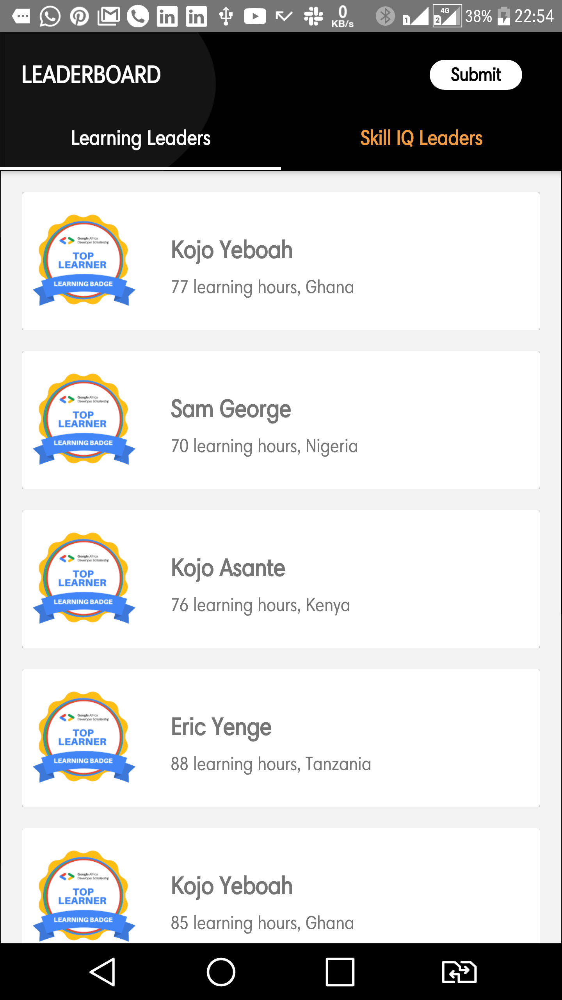
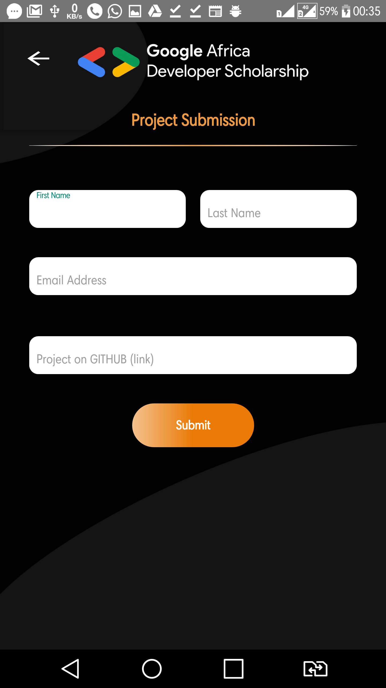

#GADS_2020_PRACTICE_PROJECT_MARO_AFENOGHO
An app that queries APIs for the top learners currently taking part in the android track of the 2020 edition of the Google Africa Developer scholarship and submits form entries through the same process.
The app makes use of libraries like Retrofit for getting data from the server and also posting data to a google form and Picasso for image rendering.

** Concepts applied **
ViewPager
RecyclerView
Fragments
ProgressBar

The Screenshots of the projects are included below:

